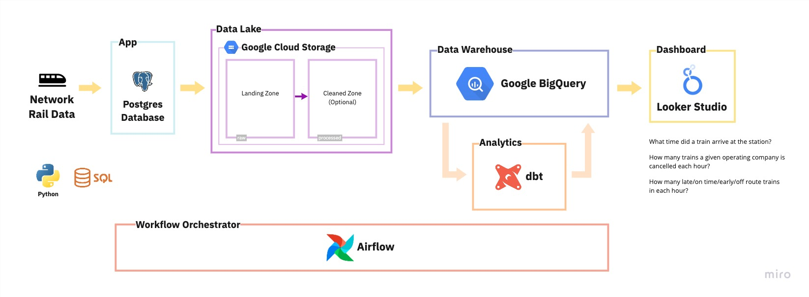

# Connect the Dots with End-to-end Data Engineering Project

ประยุกต์ใช้ความรู้ตลอดทั้ง Bootcamp มาลงมือทำจริงผ่านโจทย์ปัญหาทางธุรกิจแบบ End-to-end ตั้งแต่
การดึงข้อมูล การจัดเก็บข้อมูล การแปลงข้อมูล จนไปถึงการนำข้อมูลมาที่ได้มาใช้ในการแก้ไขปัญหาต่าง ๆ



## Starting Airflow

Before we run Airflow, let's create these folders first:

```sh
mkdir -p ./dags ./config ./logs ./plugins ./tests ./dbt ./pyspark ./spark-events
```

On **Linux**, please make sure to configure the Airflow user for the docker-compose:

```sh
echo -e "AIRFLOW_UID=$(id -u)" > .env
```

See [Setting the right Airflow
user](https://airflow.apache.org/docs/apache-airflow/stable/howto/docker-compose/index.html#setting-the-right-airflow-user)
for more detail.